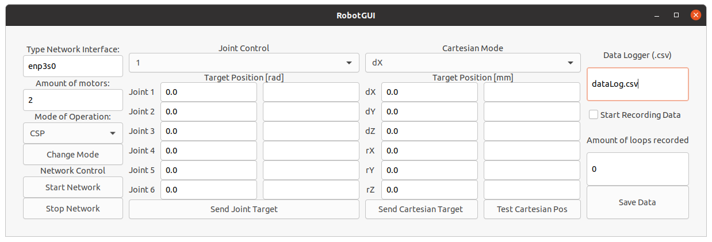

# Robot Arm EtherCAT Master
This project was meant to control a custom 6-Degrees-of-Freedom Robotic Arm using ethercat drivers
<p align="center">
  
  <br>
  <b>Figure: Robot Arm EtherCAT GUI</b>
</p>

## Results
Here is a [link](https://youtu.be/VUlx2A8uqoY) to a Youtube video showing this project in action

## Requirements
- OS: Linux 20.04 LTS (can work in other releases but it was developed on this one)
- Computer: any regular laptop or desktop with a network card compatible with EtherCAT
- Single Board Computers: this project works on the Nvidia Jetson nano as it is and possibly it works on raspberry pi as well

## Compatible EtherCAT Modules
- Maxon's EPOS4
- Cubemars Motor Driver
- DIEWU GPIO Box

## Installation
1. Clone this repository
2. On the root of the project run the [install.sh](install.sh)
```bash
install.sh
```
3. Double check that everything installed fine
```bash
ls $RA_ECAT
```
```bash
ls $SOEM
```

## Testing
To test this project run:
1. change directories to the root of the folder:
```bash
cd $RA_ECAT
```
2. Build the project:
```bash
./scripts/build.sh
```
3. Run one of the templates:
```bash
./build/RobotGUI
```
NOTE: it may be required to use sudo since this programs use the network interface of the computer